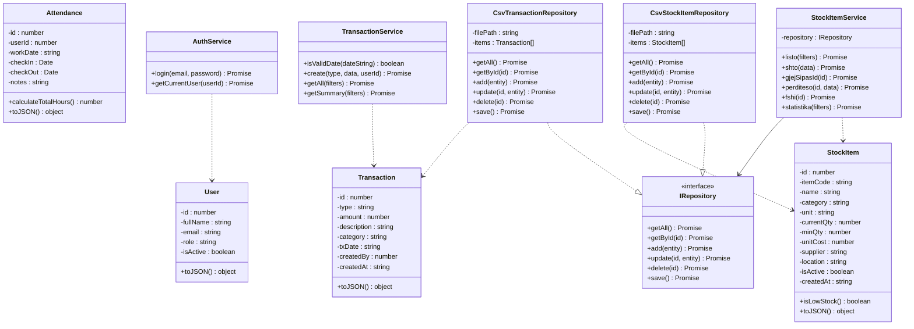

# UML Class Diagram

```mermaid
classDiagram
    class User {
        -id : number
        -fullName : string
        -email : string
        -role : string
        -isActive : boolean
        +toJSON() object
    }

    class Transaction {
        -id : number
        -type : string
        -amount : number
        -description : string
        -category : string
        -txDate : string
        -createdBy : number
        -createdAt : string
        +toJSON() object
    }

    class Attendance {
        -id : number
        -userId : number
        -workDate : string
        -checkIn : Date
        -checkOut : Date
        -notes : string
        +calculateTotalHours() number
        +toJSON() object
    }

    class StockItem {
        -id : number
        -itemCode : string
        -name : string
        -category : string
        -unit : string
        -currentQty : number
        -minQty : number
        -unitCost : number
        -supplier : string
        -location : string
        -isActive : boolean
        -createdAt : string
        +isLowStock() boolean
        +toJSON() object
    }

    class AuthService {
        +login(email, password) Promise
        +getCurrentUser(userId) Promise
    }

    class TransactionService {
        +isValidDate(dateString) boolean
        +create(type, data, userId) Promise
        +getAll(filters) Promise
        +getSummary(filters) Promise
    }

    class StockItemService {
        -repository : IRepository
        +listo(filters) Promise
        +shto(data) Promise
        +gjejSipasId(id) Promise
        +perditeso(id, data) Promise
        +fshi(id) Promise
        +statistika(filters) Promise
    }

    class IRepository {
        <<interface>>
        +getAll() Promise
        +getById(id) Promise
        +add(entity) Promise
        +update(id, entity) Promise
        +delete(id) Promise
        +save() Promise
    }

    class CsvTransactionRepository {
        -filePath : string
        -items : Transaction[]
        +getAll() Promise
        +getById(id) Promise
        +add(entity) Promise
        +update(id, entity) Promise
        +delete(id) Promise
        +save() Promise
    }

    class CsvStockItemRepository {
        -filePath : string
        -items : StockItem[]
        +getAll() Promise
        +getById(id) Promise
        +add(entity) Promise
        +update(id, entity) Promise
        +delete(id) Promise
        +save() Promise
    }

    AuthService ..> User
    TransactionService ..> Transaction
    StockItemService ..> StockItem
    StockItemService --> IRepository
    CsvTransactionRepository ..|> IRepository
    CsvStockItemRepository ..|> IRepository
    CsvTransactionRepository ..> Transaction
    CsvStockItemRepository ..> StockItem
```
